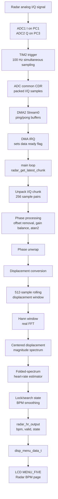

# Radar BPM Signal Path

```mermaid
flowchart TD
    A[Radar analog I/Q signal] --> B[ADC1 I on PC1<br/>ADC2 Q on PC3]
    B --> C[TIM2 trigger<br/>100 Hz simultaneous sampling]
    C --> D[ADC common CDR<br/>packed I/Q samples]
    D --> E[DMA2 Stream0<br/>ping/pong buffers]
    E --> F[DMA IRQ<br/>sets data ready flag]

    F --> G[main loop<br/>radar_get_latest_chunk]
    G --> H[Unpack I/Q chunk<br/>256 sample pairs]
    H --> I[Phase processing<br/>offset removal, gain balance, atan2]
    I --> J[Phase unwrap]
    J --> K[Displacement conversion]

    K --> L[512-sample rolling<br/>displacement window]
    L --> M[Hann window<br/>real FFT]
    M --> N[Centered displacement<br/>magnitude spectrum]
    N --> O[Folded-spectrum<br/>heart-rate estimator]
    O --> P[Lock/search state<br/>BPM smoothing]

    P --> Q[radar_hr_output<br/>bpm, valid, state]
    Q --> R[disp_menu_data_t]
    R --> S[LCD MENU_FIVE<br/>Radar BPM page]
```
