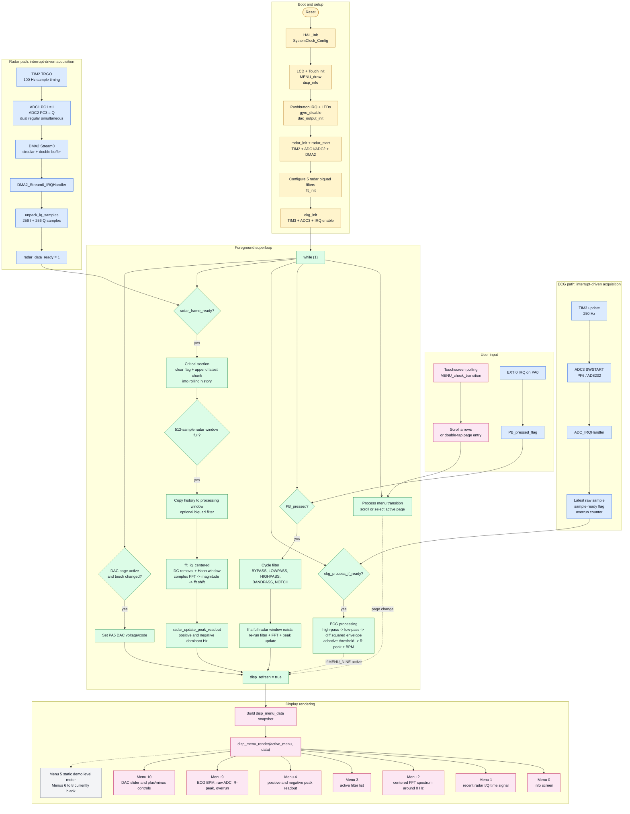

# Firmware Architecture

This firmware is a non-RTOS STM32F429 application built around one foreground superloop in `main.c`. The time-critical acquisition happens in interrupts, while the heavier signal processing and all LCD rendering happen in the main loop.

## High-Level Flowchart

## What The Code Is Really Doing

- `main.c` is the conductor: it boots the board, starts radar and ECG acquisition, polls the touchscreen, handles the pushbutton, and decides when the display should redraw.
- Radar is block-based: the ISR only moves fresh I/Q samples into buffers, and the main loop turns those overlapped windows into filtered time signals, FFT data, and peak frequencies.
- ECG is sample-based: interrupts capture one ADC sample at a time, and the main loop runs the beat-detection math that produces `R-peak` events and BPM.
- The LCD is menu-driven: the renderer picks one page from the current menu and draws either radar, ECG, DAC, or info content.
- Menu 5 draws a fixed demo level meter; menus 6, 7, and 8 do not currently render live processing results.
